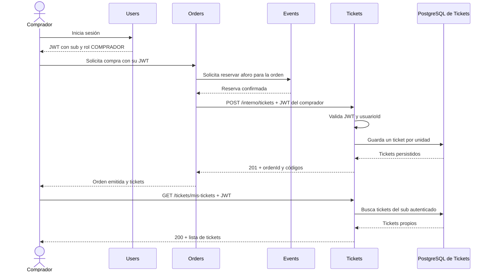
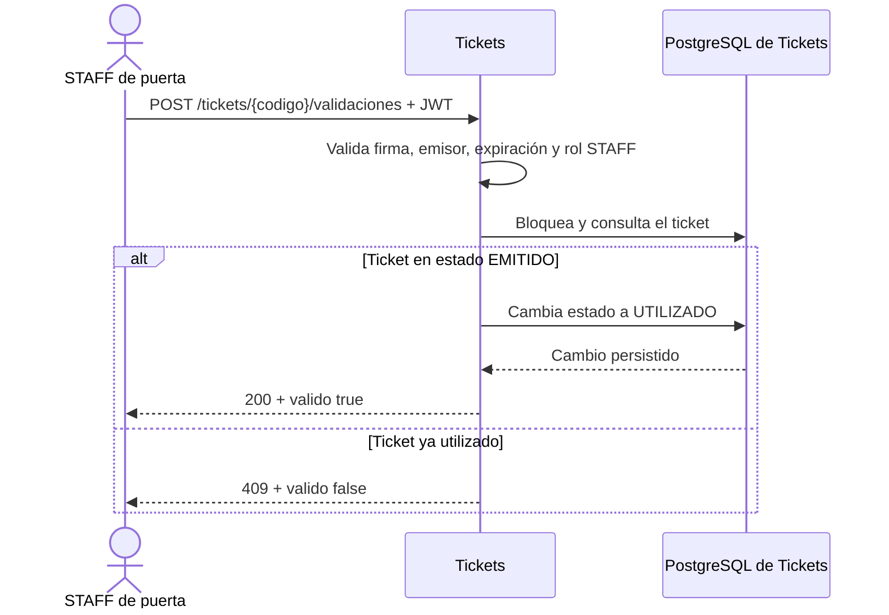

# Microservicio Tickets EventPass

Tickets administra los códigos de acceso emitidos para las compras de EventPass. Recibe una solicitud de emisión de Orders después de que Events confirma la reserva, permite que cada comprador consulte sus propios tickets y permite que STAFF valide cada código una sola vez.

Este repositorio contiene únicamente el microservicio Tickets. Se comunica por HTTP/REST y JSON, mantiene su propia base de datos PostgreSQL y no consulta las bases de datos de Users, Events u Orders. La implementación descrita corresponde al flujo local acordado; API Gateway, SQS, Lambda y otros componentes AWS quedan fuera de este alcance.

## Qué hace

- Emite un ticket por cada unidad solicitada por Orders tras una reserva confirmada.
- Genera códigos aleatorios con prefijo `EVP-` y restricción de unicidad en la base de datos.
- Devuelve los tickets existentes si Orders repite una emisión con los mismos datos para una orden.
- Permite que un comprador consulte sus propios tickets, usando el JWT emitido por Users.
- Permite que STAFF valide un código y marca el ticket como `UTILIZADO`.
- Impide que un ticket utilizado se valide correctamente otra vez.
- Guarda `ordenId`, `usuarioId` y `eventoId` como identificadores externos, sin relaciones JPA entre microservicios.

El servicio no administra eventos, órdenes, reservas ni cuentas. No contempla reembolsos ni cancelaciones de tickets; por eso no expone una operación de eliminación. Los estados implementados son `EMITIDO` y `UTILIZADO`.

## Especificaciones técnicas

| Componente | Especificación |
|---|---|
| Java | 21 |
| Spring Boot | 4.1.1 |
| Construcción | Maven Wrapper |
| Aplicación | Spring Web MVC, Spring Security, Spring Data JPA y Bean Validation |
| Base de datos | PostgreSQL |
| Tokens | JWT HMAC compartido con Users, usando JJWT 0.13.0 |
| Puerto local | 8081 (configurable con `SERVER_PORT`) |

Tickets valida la firma HMAC, el emisor `eventpass-users` y la expiración del JWT. El token debe incluir el id del usuario en `sub`, junto con los claims `email` y `rol`, siguiendo el formato que emite Users.

## Endpoints

Todas las rutas están bajo `http://localhost:8081` durante el desarrollo local.

| Método | Ruta | Autenticación | Descripción |
|---|---|---|---|
| `POST` | `/interno/tickets` | Bearer JWT de `COMPRADOR` | Emite tickets para una orden cuya reserva ya confirmó Events. Orders debe reenviar el JWT del comprador. |
| `GET` | `/tickets/mis-tickets?usuarioId={usuarioId}` | Bearer JWT de `COMPRADOR` | Lista los tickets del usuario autenticado. El parámetro debe coincidir con `sub`. |
| `POST` | `/tickets/{codigo}/validaciones` | Bearer JWT de `STAFF` | Marca como utilizado un código emitido. No requiere cuerpo. |

### Emitir tickets

`POST /interno/tickets`

Headers: `Authorization: Bearer <JWT del comprador>` y `Content-Type: application/json`.

Solicitud:

```json
{
  "ordenId": 901,
  "usuarioId": 12,
  "eventoId": 45,
  "cantidad": 2
}
```

Primera emisión: `201 Created`.

```json
{
  "ordenId": 901,
  "tickets": [
    {"ticketId": 3001, "codigo": "EVP-7KQ4XH9M2W3A"},
    {"ticketId": 3002, "codigo": "EVP-8N5T3Y6P4Z2B"}
  ]
}
```

Cada identificador debe ser positivo y `cantidad` mayor que cero. El `usuarioId` debe coincidir con el `sub` del JWT. Si se repite la solicitud después de una emisión completada y coinciden `ordenId`, `usuarioId`, `eventoId` y `cantidad`, Tickets responde `200 OK` con los mismos códigos. Si una orden existente recibe datos distintos, responde `409 Conflict`.

### Consultar tickets del comprador

`GET /tickets/mis-tickets?usuarioId=12`

Requiere JWT de `COMPRADOR`; `usuarioId` debe coincidir con el `sub`. Responde `200 OK` con los tickets del comprador ordenados del más reciente al más antiguo. Si no tiene tickets, devuelve una lista vacía `[]`.

```json
[
  {
    "ticketId": 3001,
    "codigo": "EVP-7KQ4XH9M2W3A",
    "ordenId": 901,
    "eventoId": 45,
    "estado": "EMITIDO"
  }
]
```

Si el `usuarioId` no coincide con el usuario autenticado, responde `403 Forbidden`.

### Validar un ticket

`POST /tickets/EVP-7KQ4XH9M2W3A/validaciones`

Requiere JWT de `STAFF`. La primera validación correcta bloquea el registro durante la transición de estado para evitar aceptar dos validaciones simultáneas del mismo ticket.

Primera validación: `200 OK`.

```json
{
  "codigo": "EVP-7KQ4XH9M2W3A",
  "estado": "UTILIZADO",
  "valido": true
}
```

Si el código ya fue utilizado, responde `409 Conflict`.

```json
{
  "codigo": "EVP-7KQ4XH9M2W3A",
  "estado": "UTILIZADO",
  "valido": false,
  "mensaje": "El código ya fue utilizado."
}
```

Un código inexistente responde `404 Not Found`.

### Respuestas de error

Los errores de validación y de negocio tienen esta forma:

```json
{
  "codigo": "CONFLICTO_TICKET",
  "mensaje": "La orden ya tiene tickets asociados con datos distintos a la solicitud"
}
```

La respuesta de código ya utilizado mantiene el formato específico definido en el contrato, con `codigo`, `estado`, `valido` y `mensaje`.

| Estado | Uso habitual |
|---|---|
| `400 Bad Request` | Campos obligatorios ausentes o valores no positivos en la emisión. |
| `401 Unauthorized` | Falta el JWT o su firma, emisor o vigencia no son válidos. |
| `403 Forbidden` | El rol no permite la operación o el `usuarioId` no coincide con el JWT. |
| `404 Not Found` | No existe el código solicitado para validar. |
| `409 Conflict` | Datos diferentes para una orden ya emitida o ticket ya utilizado. |

## Flujos de Tickets

### Emisión y consulta



Orders coordina la compra de forma síncrona: primero obtiene la reserva de Events y luego solicita la emisión. Tickets no consulta directamente Events ni Orders; confía en que Orders respeta ese orden del contrato.

### Validación de acceso



### Propiedad de datos

| Servicio | Datos que administra relacionados con este flujo |
|---|---|
| Users | Usuarios, credenciales, roles y emisión del JWT. |
| Events | Eventos, aforo y reservas. |
| Orders | Orden, comprador, evento, cantidad y coordinación de la compra. |
| Tickets | Código, orden asociada, comprador, evento y estado del ticket. |

Cada servicio accede a su propia base de datos. Tickets persiste `usuarioId`, `eventoId` y `ordenId` como identificadores, no como relaciones JPA remotas.

## Ejecutar en entorno local

### Requisitos

- JDK 21.
- Docker Desktop con Docker Compose para levantar PostgreSQL local, o una instancia PostgreSQL compatible.
- Microservicio Users para obtener los JWT de comprador y STAFF.
- Maven Wrapper incluido en el repositorio; no es necesario instalar Maven por separado.

### 1. Configurar variables locales

Desde la raíz del repositorio, crea `.env` a partir del ejemplo solo si todavía no existe:

```powershell
if (-not (Test-Path .env)) { Copy-Item .env.example .env }
```

Si ya tienes un `.env`, consérvalo y actualiza ahí `DB_URL`, `DB_PASSWORD` y `DB_HOST_PORT`; no lo sobrescribas. El `JWT_SECRET_BASE64` debe seguir coincidiendo con Users.

Variables reconocidas:

| Variable | Uso | Predeterminado |
|---|---|---|
| `DB_URL` | URL JDBC de PostgreSQL. | `jdbc:postgresql://localhost:5434/eventpass_tickets` |
| `DB_USERNAME` | Usuario de PostgreSQL. | `postgres` |
| `DB_PASSWORD` | Contraseña local de PostgreSQL. | `tickets_local_dev` en el ejemplo |
| `DB_HOST_PORT` | Puerto publicado en el host para PostgreSQL. | `5434` |
| `SERVER_PORT` | Puerto HTTP. | `8081` |
| `JWT_SECRET_BASE64` | Clave Base64 para validar la firma; obligatoria y compartida con Users. | Sin valor |
| `JWT_ISSUER` | Emisor requerido en el JWT. | `eventpass-users` |

`JWT_SECRET_BASE64` debe tener exactamente el mismo valor que en Users. No copies una clave de ejemplo si Users está usando otra. `.env` está excluido de Git; no lo compartas ni lo subas. Los valores de contraseña incluidos son solo para desarrollo local; puedes cambiarlos, pero usa el mismo `DB_PASSWORD` en la aplicación y en Compose. Hibernate usa `ddl-auto=update` para crear o actualizar las tablas locales durante el desarrollo.

### 2. Levantar PostgreSQL con Docker Compose

El Compose crea únicamente la base `eventpass_tickets` y la publica en `127.0.0.1:5434`. El volumen `eventpass-tickets-postgres-data` conserva los datos al detener el contenedor.

```powershell
docker compose -f compose.postgres.yaml up -d
docker compose -f compose.postgres.yaml ps
```

Este archivo levanta la base de datos, no la aplicación Tickets. Para detener PostgreSQL sin borrar su volumen:

```powershell
docker compose -f compose.postgres.yaml down
```

### 3. Iniciar la aplicación

En Windows, desde la raíz del repositorio:

```powershell
.\mvnw.cmd spring-boot:run
```

La API queda disponible en `http://localhost:8081` (o en el puerto configurado en `SERVER_PORT`).

### 4. Probar con Postman

1. Inicia Users y Tickets.
2. Inicia sesión en Users con una cuenta `COMPRADOR` mediante `POST http://localhost:8080/auth/login` y conserva el `token` y `usuario.id` de la respuesta.
3. Envía `POST http://localhost:8081/interno/tickets` con ese JWT como Bearer y con `usuarioId` igual a `usuario.id`. Usa un `ordenId` nuevo y una cantidad positiva.
4. Repite la solicitud con los mismos valores; espera `200` y los mismos tickets. Cambia la cantidad para esa orden y espera `409`.
5. Consulta `GET http://localhost:8081/tickets/mis-tickets?usuarioId={usuario.id}`. Prueba otro ID y confirma `403`.
6. Inicia sesión con una cuenta `STAFF` y valida un código mediante `POST http://localhost:8081/tickets/{codigo}/validaciones`. Repite la llamada y confirma `409`.
7. Prueba una ruta protegida sin token (`401`) y una operación con rol incorrecto (`403`).

## Alcance y decisiones

- Tickets emite solo después de que Orders obtuvo confirmación de reserva de Events.
- Para mantener la integración acordada sin una credencial adicional de servicio, Orders reenvía el JWT de `COMPRADOR`. Tickets valida el usuario y su rol, pero el token no demuestra que la llamada provenga exclusivamente de Orders; un comprador con JWT válido puede invocar la ruta interna directamente.
- Los reintentos posteriores a una emisión completada son idempotentes. Dos solicitudes simultáneas para una misma orden todavía pueden competir antes de persistir; el esquema evita duplicar la numeración del ticket, pero este caso concurrente requerirá tratamiento adicional.
- No hay flujo de reembolso o cancelación en el contrato actual. Tickets no libera aforo y no borra tickets; esa coordinación correspondería a Orders y Events si el alcance cambiara.
- La comunicación local es REST/JSON síncrona. AWS queda fuera de esta versión.

## Información del proyecto

- Puerto local coordinado: Users `8080`, Tickets `8081`, Orders `8083`.
- El contrato entre servicios se documenta en `Contrato_Comunicacion_EventPass.md`, mantenido por el equipo fuera de este repositorio.
- Los cambios funcionales se integran primero en `develop`; `main` se reserva para versiones y releases.
